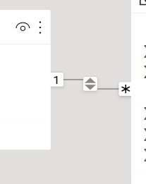
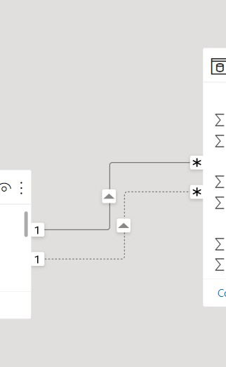

# Key Difference Between Power Query (M language) and DAX

Both languages can be fast for small querys, but, for large queries M language is faster. This is because a computed column (M language) are generated at import time, so only is computed one time. Meanwhile, the calculated column (DAX) is computed every with every interaction with a visual.

# Power BI General Information
## Connect data
We can connect data of two ways:
* Importing the data to Power BI
* **DirectQuery**

The former charge the data to PowerBI and the latter make a query to a database. In the second is importand only query the relevantdata to the Power BI for performance problemns than can carry this data volume magnitude.

## About merge key in Power BI

Power BI only supports **one** columns by merge, so if we have multiple key columns we need to aggregate it to use it as one.


# Power Bi (Dax, Data Analysis eXpressions) Notes

## DAX context
The behaviour of DAX calculations changes with the context there are 3 of them:
* Row, 
* Query,
* Filter.

Is crutial to undertant how this context work joinly with DAX. This enables a dynamic analysis based in the  selecction of a set of rows. There a variety of examples like exclude a category with a slicer this will calculate a summarization without that category.

So DAX in:

1. **Row-level** is implicated when we create a calculated column. This values is calculated row by row.
2. **Query-level** are those that are affected by a slicer, a interaction with visual, the implicated values is a subset retrived for a formula and is applied after row context.

3. **FIlter-level** these are values allowed from any column or retrieved from related table. By using argumentes to a formula or by using report filter in a row and columns headings.

## Implicit vs Explicit Measures

Is important to know this interaction to understand how to DAX works.

* **Implicit** Is automatically created by Power BI or comes directly from database. The example of this functionality is when we use visual, any visual will apply an implicit function like summarizing with a sum.

* **Explicit** This is all the DAX functions written by the user. This bring a lot of flexibity about the calculations.

There a good practices to work with meaures.
* Maintain the measures grouped, this can be achieved with a new table with all the measures.
* Use a good formatting to write DAX functions and add comments in the complicated parts.
* use another variable (`VAR`) to store intermediate steps when write a complex DAX functions. 
```
//Syntax for declare a variable in a DAX function

VAR
<Name of Var> = <expression>
RETURN  
```
An example would look like this:
```
Cost Growth = 

VAR
CostPriorYear = CALCULATE([Cost], SAMEPERIODLASTYEAR('Date'))
RETURN

// Then using it  in DAX formula

Cost Growth = [Cost] - CostPriorYear
```

## CALCULATE a handy operation
This function in DAX is very handy, because let you do a lot of things. The function takes an expresion to evaluate and optianl filters to select the data under different creteria.
`CALCULATE(<expression>, [<filter1>, <filter2>])`

We can use simple to filter data or to more complex things, an example of filtering in a divition is:
```
// function to calculate  % increment to respect previous year

YoY % = 

VAR
salesPreviousYear = CALCULATE([sales], SAMEPERIODLASTYEAR([date]))
RETURN

DIVIDE ([sales] - salesPreviousYear, salesPreviousYear)

```
## How to create a data time table

For create a date time table to work with, we can do it with DAX commands, this is, create a table with a simple command  only with  start date and end date:
```
DateTable = CALENDAR(DATE(1994), TODAY())
```
This create a table. But if we only want the year, for example, we can do the next:
```
Year = DISTINCT(
    SELECTCOLUMNS(
        CALENDAR(DATE(1994, TODAY()),
        "YEAR", YEAR(Date]))
    )
)
```
This snipped is simple, just create the calendar with all the dates from 1994 to today, consecuently extract the year from column `[Date]` (This column exists because the `CALENDAR` function created it internally), this column is selected with `SELECTCOLUMNS` and renamed to `YEAR`, and finally only gets the non duplicated values with `DISTINCT`.

### How to add more time information with columns...

In the data view of Power BI we can add more columns (pressing the `Add column` button in the ribbon) to aggregate more information that is relevant to our analysis we can type this in the formula window:

```
"Year"[Year] - MOD ("YEAR"[YEAR], 10)
```
This creates a columns with the **Decade** corresponding to each year. As can you see we can work with numerical expressions.

## Bideretional Relations
**Note:** Sometimes this kind of relations can be very inneficient and can be replace with [filter measueres](#filter-measures)
A relation between tables is usually in only one direction but there are circunstances where we can have a bidirectional relation.

The bidirectional relational are useful to filter slicers. When a option doesn't exist in the slicer with this relation we can avoid to show invalid options.

In the schema view in Powe BI we can see this relation like a relation with two arrow like the next image.




## Filter Measures

This can be used to reemplace bi-directional relations between tables making our querys more efficient. This works with DAX functions and the goal is to make a dimentional slicer only have relevant data to fact table as the bi-directional table would does.

The trick here is to that the DAX function return 1 if the fact table is not empty for one value in the slicer otherwise return 0:
```
Slicer filter = INT(NOT ISEMPTY('MyFactTable1'))
```
Later this formula is added to the FILTER ribbon of every slicer to show the values only with the option is 1.


**Note:** slicer filter is the name of the mesaure we created.
As we can see this filter measure is used in the filter section of every slicer only showing the values relevant to our fact table. Thats is cool, no?

## Inactive relations (Role Playing dimentions)

Usually this mode is achieved with duplicated tables and loops, but, Power Bi is something different. The correct way is achieved with `USERELATION` (a DAX function) the use is described on next.



Power query only allows to use one "active" relation between tables. But sometimes is necessary to have more than one, yeah we can add more, but, these relations are inactive by default. These relations only can be used inside a DAX function and we need to explicitly specify it. This can be very use full in some situations.

```
CustomMeasure = CALCULATE(AVERAGE('TABLE1'[column]),    USERELATION('TABLE1'[column1], 'TABLE2'[column2]))
```

* `CALCULATE` can be used to evalute an expression with a condition or a relation inactive between two columns.
* `USERELATION` is used to represent a inactive relation, the first argumente (qualified column) is the many to  one side and the second argument is the side one to many. If the arguments are changed the function swap it.

With this we can have function that behave different and help us to resolve different business question witout duplicate data.


# Power Query (M language)
## Replacing multiple characters

To modify/eliminate multiple character you must first create a list with then. We can be achieved with next formula:


```
Vals2List= Text.ToList("',[]") # Where the character between " symbol are the character to erase.
```

Next we use this list, in special fucntion (`List.Accumulate`) that apply one operation multiple times, in this case apply the erasing character for each elemetn of `Vals2List`, this operation reminds the syntax of anonymous funtion in JAVA or lambda fuctions in Python.

```
= List.Accumulate(Vals2List, #"Removed Other Columns", (table, old)=>Table.ReplaceValue(table,old,"",Replacer.ReplaceText,{"Job Skills"}))
```

Where:
- `Vals2List` is the list created previously with the characters to delete.
- `#"Removed other columns"` is the table to modify, this table can be the result of another operation previously made.
- `table,  old`, these are lambda function variables, and can have any name,
- `{"Job Skills"}` is a list of columns where at least one column must to exist.

The other names/varaibles are function part syntax.

This informatin was take from [here](https://www.youtube.com/watch?v=N-0JrYQB0Ag)